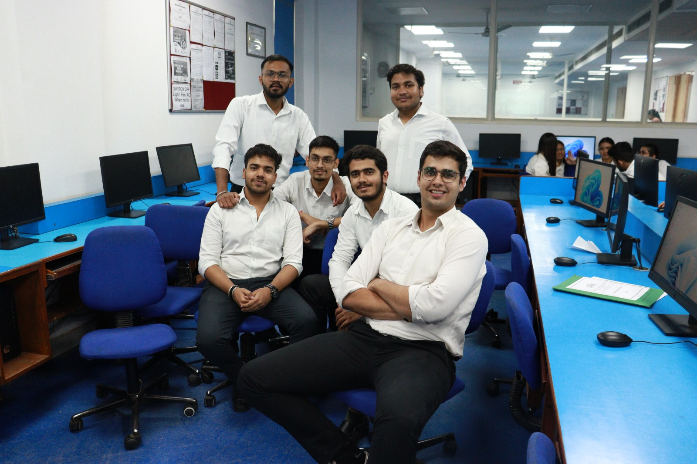
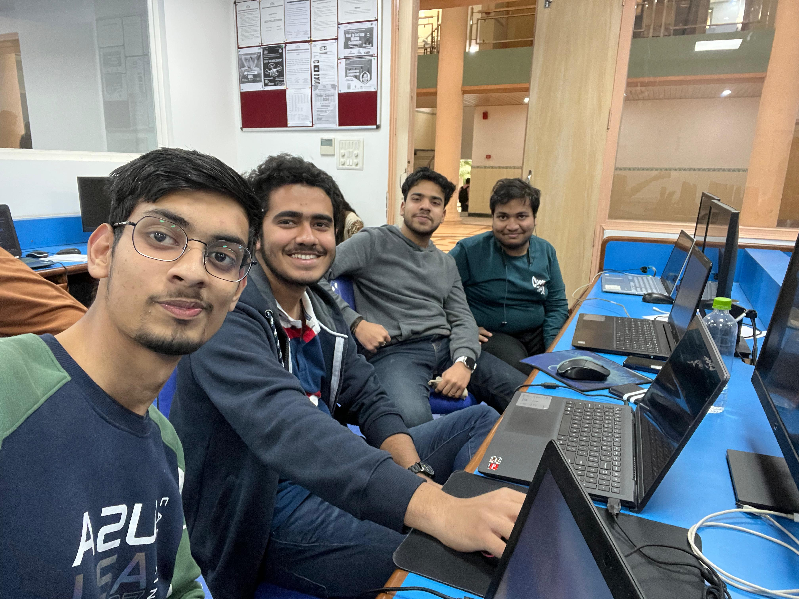

# CYBER-GEEKS
🚀 We're a dynamic team focused on IoT and robotics 🤖, building smart, connected systems for the future 🌟. Our projects range from automation to intelligent devices 🔧, always pushing the limits of technology. Join us as we innovate and create cutting-edge solutions that transform industries! ⚙️💡
<hr>
Here’s a detailed description you can use for your **GitHub repository** for the **CYBER GEEKS** project:

---

# 🤖 **CYBER GEEKS: IoT & Robotics Team** 🌐

Welcome to the official repository of **CYBER GEEKS** – a dedicated team of enthusiasts and innovators working on projects in the fields of **IoT (Internet of Things)** and **robotics**. Our mission is to create intelligent, automated solutions that bridge the gap between physical devices and cloud-based technologies, making daily tasks smarter and more efficient.

This repository showcases our ongoing work, providing resources, documentation, and code for anyone interested in exploring the potential of IoT and robotics.

---
<div align="center">
   
</div>

## 🚀 **Project Overview**

**CYBER GEEKS** focuses on building systems that integrate IoT and robotics for various real-world applications. Our projects range from automating simple household devices to creating complex robots that can interact with their environments intelligently.

We aim to push the boundaries of technology by:
- Developing **connected systems** that gather, process, and act on real-time data.
- Designing **robotic solutions** that can interact with the physical world autonomously.
- Integrating **AI/ML models** to enable smart decision-making across devices.

---

## 📂 **Repository Contents**

Here’s what you’ll find in this repository:

1. **IoT Modules**:  
   - Prototypes of connected devices that communicate over a network to perform various automated tasks.
   - Examples include **home automation systems**, **smart sensors**, and **remote monitoring systems**.

2. **Robotics Prototypes**:  
   - Early designs of robots integrated with IoT technology, allowing for remote control and monitoring.
   - **Robotic arms**, **autonomous vehicles**, and **environment-sensing robots** are just a few examples of what’s in progress.

3. **Media Files**:  
   - **Photos**: High-quality images of our working prototypes, hardware setups, and ongoing project designs.
   - **Videos**: Demo videos showcasing robots in action and IoT systems performing automated tasks.  
   (Note: Due to size limitations, some media files are available through **Git LFS** or linked externally from **cloud storage**.)

4. **Documentation**:  
   - Detailed guides and manuals on how to set up and use our IoT and robotics projects.
   - Instructions on replicating our work, along with an overview of the technologies and components used.

5. **Codebase**:  
   - Source code for both IoT and robotics projects. This includes the firmware for devices, API integrations, and scripts for robotic controls.
   - Ready-to-use scripts to deploy IoT devices and integrate them with **cloud platforms**.

---

## 🔧 **Technologies Used**

Here are the key technologies and platforms that power the **CYBER GEEKS** projects:

- **IoT Platforms**:  
   - **Raspberry Pi**, **Arduino**, and other microcontrollers for creating connected devices.
   - **MQTT**, **HTTP**, and other communication protocols for real-time data exchange.

- **Robotics**:  
   - Hardware designs for robots, including **3D-printed parts**, **motors**, and **sensors**.
   - **ROS (Robot Operating System)** for controlling and managing robot behavior.

- **Cloud & AI Integration**:  
   - **AWS**, **Google Cloud**, and **Microsoft Azure** for cloud connectivity.
   - **AI/ML algorithms** to enable smart, automated decision-making and control.

---

## 🌱 **Getting Started**

To get started with our projects, follow the instructions below:

1. **Clone the Repository**:
   ```bash
   git clone https://github.com/your-repo/cyber-geeks.git
   ```

2. **Install Dependencies**:
   Each project has its own set of dependencies that are listed in the respective folders. Please refer to the `README.md` in each module for specific setup instructions.

3. **Run the Projects**:
   Once you have set up the dependencies, follow the instructions to deploy the IoT devices or robots in your environment.

---

## 🎯 **Future Roadmap**

We are continuously working on new features and improvements. Here’s what you can expect in future releases:

1. **Enhanced IoT Automation**:  
   - More advanced communication protocols, better security, and higher device scalability.

2. **Smarter Robots**:  
   - Autonomous robots with enhanced sensing capabilities, better mobility, and smarter AI decision-making.

3. **Cross-Platform Integration**:  
   - Support for additional IoT platforms and easier integration with third-party applications.

4. **AI-Powered Automation**:  
   - Implementation of machine learning algorithms to make devices and robots more intelligent and adaptive.

---

## 👥 **Meet the CYBER GEEKS Team**

Our team is made up of passionate engineers, developers, and creators, dedicated to exploring the endless possibilities of IoT and robotics:

- **Dhruv Dhayal** – Project Lead and Robotics Expert
- **Team Members**:  
   A skilled group of IoT specialists, robotics engineers, and software developers contributing to our innovative projects.

---
<div align="center">

   </div>


## 🛠 **Contributing to CYBER GEEKS**

We welcome contributions from anyone interested in IoT, robotics, or automation! Here’s how you can get involved:

1. **Fork the Repository**:  
   Create your own fork of the repository to start contributing.

2. **Report Issues**:  
   Found a bug or have a feature request? Open an issue in the repo and let us know.

3. **Submit Pull Requests**:  
   Make improvements, add features, or fix bugs and submit a pull request to get your code reviewed and merged.

---

## 📢 **Feedback & Support**

Your feedback is valuable to us! If you have any suggestions, encounter issues, or would like to discuss potential collaborations, feel free to:

- **Open an Issue** on GitHub.
- Reach out to us via **email** or the contact details provided in the repository documentation.

---

Stay tuned for more exciting updates as we continue to push the boundaries of IoT and robotics with **CYBER GEEKS**! 🚀

---

This description covers every aspect of your project, from what’s included to future goals and how to contribute. You can copy it directly into your GitHub repository and modify it as needed.
